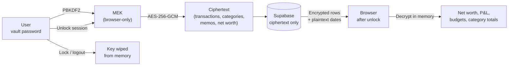

<div align="center">

# Orange Way

### Personal finance where your bank, your aggregator, and your tracker cannot read your books.

**Open-source. Zero-knowledge. Bitcoin-native.**

[](./LICENSE)
[](./.github/workflows/ci.yml)
[](#status)
[](#how-it-works)
[](#self-host)
[](#why-this-exists)

[**Why this exists**](#why-this-exists) ·
[**What makes us different**](#what-makes-us-different) ·
[**How it works**](#how-it-works) ·
[**Contributing**](./CONTRIBUTING.md) ·
[**Security**](./SECURITY.md)

</div>

---

## Why this exists

> _"Here we are faced with the problems of loss of privacy, creeping computerization, massive databases, more centralization — and \[David\] Chaum offers a completely different direction to go in, one which puts power into the hands of individuals rather than governments and corporations. The computer can be used as a tool to liberate and protect people, rather than to control them."_
>
> *Hal Finney, cypherpunks mailing list, November 1992*

Thirty-four years later, every mainstream personal-finance product operates exactly the way Finney warned against.

**Monarch.** Copilot. Simplifi. Empower. YNAB. Quicken. Intuit Mint (until Intuit [shut it down in March 2024](https://www.mint.com/), giving 3.6 million users 90 days to migrate or lose years of financial history). **Every single one** stores your transactions, categories, budgets, notes, net-worth history, and connected-account credentials in a form their servers can read. "Bank-level encryption" means TLS in transit and AES at rest, **with the keys they hold.** One breach, one subpoena, one curious employee, one rogue administrator, and every line of your financial narrative is legible to someone who is not you.

That bargain made sense when "the cloud" was new. It makes less sense when:

- **[LastPass was breached in 2022.](https://en.wikipedia.org/wiki/LastPass_2022_data_breach)** Attackers exfiltrated encrypted vaults and spent the next three years brute-forcing weak master passwords. In March 2025, [federal prosecutors linked a $150 million cryptocurrency heist](https://krebsonsecurity.com/2025/03/feds-link-150m-cyberheist-to-2022-lastpass-hacks/) directly to that breach. The only reason most vaults were safe is that their master passwords were strong enough.
- **Intuit killed Mint in 2024.** Millions had to manually extract or migrate years of financial history under a 90-day deadline. The lesson a self-hosted, open-source tracker would have taught: _vendor risk is your risk._
- **Plaid, the aggregator most of these products sit on top of**, stores bank credentials in a form its servers can decrypt. As one Hacker News commenter put it in 2021: _"Plaid is only one security breach away from being utterly destroyed."_ [[HN, August 2021]](https://news.ycombinator.com/item?id=28229319)
- **"Bank-level encryption"** is a marketing phrase, not an architectural claim. Banks are also targets. See Equifax (147M), Capital One (106M), T-Mobile (37M), MOVEit (financial services, 2023), Change Healthcare ($22M ransom, 100M Americans, 2024). The pattern is the database, not the industry.

**Orange Way flips the model.**

The browser holds the **vault password**. It derives a key that **never leaves the device**. Before any transaction, category, memo, or account label touches Supabase, it is encrypted client-side. Balances, net worth, and category totals are computed **where the key already lives**: in your session, after unlock. The server stores ciphertext plus transaction dates (needed for filtering). If our database is breached, the attacker gets opaque blobs.

We did not invent "encrypt the database." We are building **a personal-finance tracker that assumes the operator is adversarial (including us) and still feels usable for a real household**.

**This is not marketing. It is architecture.** [Read the threat model](./SECURITY.md).

---

## What makes us different

|                                           | Mint (killed 2024) | Monarch | Copilot | Simplifi | Empower |  YNAB   | **Orange Way** |
| ----------------------------------------- | :----------------: | :-----: | :-----: | :------: | :-----: | :-----: | :------------: |
| Open source                               |         ✗          |    ✗    |    ✗    |    ✗     |    ✗    |    ✗    |     **✓**      |
| Self-hostable                             |         ✗          |    ✗    |    ✗    |    ✗     |    ✗    |    ✗    |     **✓**      |
| Bitcoin-native (on-chain + Lightning)     |         ✗          | partial |    ✗    |    ✗     | partial |    ✗    |     **✓**      |
| Server can read your categories and memos |         ✓          |    ✓    |    ✓    |    ✓     |    ✓    |    ✓    |     **✗**      |
| Server can read your net-worth history    |         ✓          |    ✓    |    ✓    |    ✓     |    ✓    |    ✓    |     **✗**      |
| Data portable without vendor cooperation  |         ✗          |    ✗    |    ✗    |    ✗     |    ✗    | limited |     **✓**      |
| Cannot be shut down by an acquirer        |         ✗          |    ✗    |    ✗    |    ✗     |    ✗    |    ✗    |     **✓**      |
| Published open threat model               |         ✗          |    ✗    |    ✗    |    ✗     |    ✗    |    ✗    |     **✓**      |

Every other tracker keeps key material to decrypt your data on its servers. We keep **only ciphertext.** Decryption requires a key derived from your vault password (in your browser), released when you unlock and garbage-collected when you lock.

If an attacker breaches our database, they get encrypted blobs plus the shape of your data (number of transactions, date ranges). Without each user's vault password, the breach is worthless.

**This is the same architecture used by [Bitwarden](https://bitwarden.com/help/bitwarden-security-white-paper/), [1Password](https://agilebits.github.io/security-design/), [Proton](https://proton.me/security/end-to-end-encryption), and [Signal](https://signal.org/docs/)**, applied for the first time to a personal-finance tracker.

---

## How it works



1. **You enter your vault password once** on unlock. It never leaves your browser.
2. **Your password stretches into an MEK** via PBKDF2-SHA256 (OWASP-recommended iteration count; see `src/lib/vault.ts` for the authoritative value). The MEK is a non-extractable WebCrypto `CryptoKey`.
3. **Every sensitive field is encrypted before insert / update.** Transaction amounts, counterparty names, categories, memos, account labels, goal targets: all ciphertext at rest.
4. **Transaction dates stay plaintext** so the server can answer "transactions in March" without seeing which transactions. This is the only metadata the server can correlate.
5. **All math (net worth, category totals, budget progress, cash-flow forecast) runs in the browser** after decrypt. The server never learns a balance.
6. **When you log out,** the MEK is released and eligible for garbage collection. We cannot read your data without you.

---

## Who this is for

- **Bitcoin holders** who want a personal tracker that speaks Bitcoin (on-chain + Lightning) as a first-class asset, not an afterthought.
- **Anyone burned by Mint's 2024 shutdown** who doesn't want to live through the same lockout again.
- **Privacy-minded households** who find it absurd that a third party knows where every dollar goes before they do.
- **Self-hosters** who refuse to upload their spending patterns to any SaaS. Same code runs on your server.
- **Developers** who want to see ZKA applied to a real personal-finance domain (accounts, transactions, categories, budgets, net-worth history) and stress-test the crypto.
- **Anyone who read "bank-level encryption"** and thought _"I wonder what that actually means."_

---

## Status

**Early development.** Today Orange Way is a local-first tracker with a working vault, transaction entry, category-encrypted storage, and a client-side dashboard. The next milestones on the roadmap:

- **Aggregator integration via [OrangeRails](https://github.com/MorningRevolution/orangerails)**: our sibling project, the zero-knowledge alternative to Plaid. Bank and exchange connections will flow through OrangeRails so your credentials never touch our server either.
- **Multi-device sync**: unlock once per device, keep encrypted data in sync through Supabase without the server learning content.
- **Budget + goal tracking** with encrypted plans and client-side progress math.
- **Bitcoin-native reporting**: cost-basis, sats-denominated net worth, Lightning transaction history.

**Nothing here is production-ready yet.** Star the repo to signal demand. Watch to follow the build.

---

## Join the fight

**This is a cypherpunk project.** Its success depends on community scrutiny, not corporate marketing.

- ⭐ **Star this repo**: visible signal to the Bitcoin + privacy ecosystem that this matters.
- 🛠️ **[Contribute](./CONTRIBUTING.md)**: code, documentation, code review, translations.
- 🔍 **Audit our encryption code** (`src/lib/`, coming soon as we publish the ZKA reference): zero-knowledge claims must be verifiable. We publish the entire path.
- 🔒 **[Responsible security disclosure](./SECURITY.md)**: credit for verified findings.
- 🗳️ **Open [issues](https://github.com/The-Orange-Way/Orange-Way-Me/issues)**: feature requests, integration requests, architectural debate.
- 📣 **Spread the word** on Nostr, Twitter/X, Hacker News, r/Bitcoin, r/selfhosted, r/personalfinance. Tell anyone who got stranded by the Mint shutdown.

---

## Self-host

_Once Phase 1 lands._ Today the app runs locally against Supabase.

```bash
git clone https://github.com/The-Orange-Way/Orange-Way-Me
cd orange-way
bun install              # or: npm ci
cp .env.example .env     # Supabase URL + anon key
bun run dev              # or: npm run dev
# Open http://localhost:5173
```

On first launch, create a vault password. Everything you enter from that point is encrypted client-side before it reaches Supabase.

**Stack:** TanStack Start (SSR-capable React) + Vite + Supabase (auth, Postgres, RLS) + Cloudflare Workers (deploy target) + TypeScript.

---

## Documentation

- **[Contributing](./CONTRIBUTING.md)**: commit + PR style (WHY not WHAT), hard rules.
- **[Security](./SECURITY.md)**: threat model, responsible disclosure, what the server can and cannot see.
- **[Code of Conduct](./CODE_OF_CONDUCT.md)**: Contributor Covenant + two project-specific pledges.

---

## Cypherpunk lineage

Orange Way stands on thirty-five years of cypherpunk thought.

- **Satoshi Nakamoto**, Bitcoin whitepaper (2008): _"electronic cash without going through a financial institution."_ [[bitcoin.org]](https://bitcoin.org/bitcoin.pdf)
- **Eric Hughes**, _A Cypherpunk's Manifesto_ (1993): _"Privacy is the power to selectively reveal oneself to the world… Cypherpunks write code."_ [[activism.net]](https://www.activism.net/cypherpunk/manifesto.html)
- **Tim May**, _The Crypto Anarchist Manifesto_ (1988): _"A specter is haunting the modern world, the specter of crypto anarchy."_ [[Nakamoto Institute]](https://nakamotoinstitute.org/library/crypto-anarchist-manifesto/)
- **Phil Zimmermann**, _Why I Wrote PGP_ (1991): _"It's personal. It's private. And it's no one's business but yours."_ [[philzimmermann.com]](https://philzimmermann.com/EN/essays/WhyIWrotePGP.html)
- **Hal Finney**, cypherpunks list (1992): _"The computer can be used as a tool to liberate and protect people, rather than to control them."_ [[Nakamoto Institute]](https://nakamotoinstitute.org/finney/)

---

## Related projects

- **[OrangeRails](https://github.com/MorningRevolution/orangerails)**: zero-knowledge aggregator (the open-source answer to Plaid). Orange Way uses OrangeRails for bank and exchange connections.

---

## License

**Apache License 2.0.** See [LICENSE](./LICENSE).

Chose Apache specifically for its explicit patent grant, essential for code that other apps will build on.

---

_Orange Way. Because "trust me with your money" is not a business model anymore._
