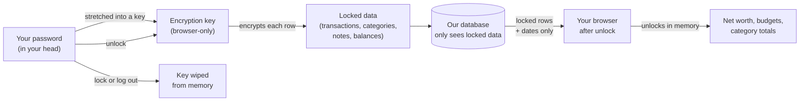

<div align="center">

# Orange Way

### Personal finance for Bitcoin households, where the tracker can't read your books.

Your categories, notes, budgets, goals, and net worth never reach our servers in a form anyone can read. Not us. Not an attacker who breaks in. Not a subpoena. The math runs in your browser, after you unlock it with a password that lives only on your device.

**This is a cypherpunk project, and we're recruiting collaborators.** [Join the build ↓](#join-the-build)

[](./LICENSE)
[](./.github/workflows/ci.yml)
[](#status)
[](#how-it-works)
[](#self-host)
[](#why-this-exists)

[**Why this exists**](#why-this-exists) ·
[**How it's different**](#how-its-different) ·
[**How it works**](#how-it-works) ·
[**Join the build**](#join-the-build) ·
[**Security**](./SECURITY.md)

</div>

---

## What this is, in one minute

Orange Way is a personal-finance app you can use to track every account in one place: checking, savings, credit cards, investments, Bitcoin, Lightning. Categories. Budgets. Goals. Net worth.

The difference from every other tracker on the market is that **our server can't read what you store with us**. Your transactions and the labels you put on them are encrypted on your laptop or phone before they leave. The encryption key is derived from a password only you know. We keep ciphertext. You keep the key. If our database gets breached tomorrow, the attacker gets opaque blobs and the shape of your data, nothing more.

You still use the app like a normal web app. The encryption is invisible.

**Three honest caveats.** Every privacy product over-promises, and most people skip the small print. Read this part:

1. **Your bank still sees your bank account.** Banks are the source of truth for their own ledger. No app on Earth changes that. What Orange Way protects is everything new that gets added inside Orange Way: the categories you assign, the memos you write, the budgets you build, the goals you set, the household plans you share, the Bitcoin holdings you track, the net-worth view across all your accounts.
2. **People you invite to your household can read what you share with them.** Orange Way supports household sharing (your partner, a trusted family member, your accountant). Whoever you invite gets keys to the rows you grant them. The privacy guarantee is against the operator and any future buyer of the company, not against people you intentionally invite.
3. **On-chain Bitcoin transactions remain on-chain.** Bitcoin's blockchain is public by design. When you connect an xpub (read-only Bitcoin wallet), the addresses and on-chain transactions stay publicly visible. We don't change that. What we don't see is your interpretation of those transactions: categories, memos, household context.

---

## Why this exists

> _"Here we are faced with the problems of loss of privacy, creeping computerization, massive databases, more centralization, and \[David\] Chaum offers a completely different direction to go in, one which puts power into the hands of individuals rather than governments and corporations. The computer can be used as a tool to liberate and protect people, rather than to control them."_
>
> _Hal Finney, cypherpunks mailing list, November 1992_

Thirty-four years later, every mainstream personal-finance product operates exactly the way Finney warned against.

Monarch. Copilot. Simplifi. Empower. YNAB. Quicken. Intuit Mint (until Intuit [shut it down in March 2024](https://www.mint.com/), giving 3.6 million users 90 days to migrate or lose years of financial history). Every single one stores your transactions, categories, budgets, notes, net-worth history, and connected-account credentials in a form their servers can read. "Bank-level encryption" means TLS in transit and AES at rest, with the keys they hold. One breach, one subpoena, one curious employee, one rogue administrator, and every line of your financial narrative is legible to someone who is not you.

That bargain made sense when "the cloud" was new. It makes less sense when:

- **[LastPass was breached in 2022.](https://en.wikipedia.org/wiki/LastPass_2022_data_breach)** Attackers exfiltrated encrypted vaults and spent three years brute-forcing weak master passwords. In March 2025, [federal prosecutors linked a $150 million cryptocurrency heist](https://krebsonsecurity.com/2025/03/feds-link-150m-cyberheist-to-2022-lastpass-hacks/) to that breach. The only vaults that stayed safe were the ones with strong master passwords.
- **Intuit killed Mint in 2024.** Millions had to manually extract or migrate years of history under a 90-day deadline. Lesson: vendor risk is your risk.
- **Plaid stores bank credentials in a form its servers can decrypt.** Plaid is the aggregator most of these apps sit on top of. As one Hacker News commenter put it in 2021: _"Plaid is only one security breach away from being utterly destroyed."_ [[HN]](https://news.ycombinator.com/item?id=28229319)
- **"Bank-level encryption" is marketing.** Banks are also targets. Equifax (147M), Capital One (106M), T-Mobile (37M), MOVEit (2023), Change Healthcare (100M Americans, 2024). The pattern is the database, not the industry.

Orange Way flips the model. We build the tracker. You hold the key. Neither of us can read your data without you.

This is not marketing. It's architecture. [Read the threat model](./SECURITY.md).

---

## How it's different

|                                           | Mint (killed 2024) | Monarch | Copilot | Simplifi | Empower |  YNAB   | **Orange Way** |
| ----------------------------------------- | :----------------: | :-----: | :-----: | :------: | :-----: | :-----: | :------------: |
| Open source                               |         ✗          |    ✗    |    ✗    |    ✗     |    ✗    |    ✗    |     **✓**      |
| Self-hostable                             |         ✗          |    ✗    |    ✗    |    ✗     |    ✗    |    ✗    |     **✓**      |
| Bitcoin-native (on-chain + Lightning)     |         ✗          | partial |    ✗    |    ✗     | partial |    ✗    |     **✓**      |
| Server can read your categories and memos |         ✓          |    ✓    |    ✓    |    ✓     |    ✓    |    ✓    |     **✗**      |
| Server can read your net-worth history    |         ✓          |    ✓    |    ✓    |    ✓     |    ✓    |    ✓    |     **✗**      |
| Data portable without vendor cooperation  |         ✗          |    ✗    |    ✗    |    ✗     |    ✗    | limited |     **✓**      |
| Cannot be shut down by an acquirer        |         ✗          |    ✗    |    ✗    |    ✗     |    ✗    |    ✗    |     **✓**      |
| Published open threat model               |         ✗          |    ✗    |    ✗    |    ✗     |    ✗    |    ✗    |     **✓**      |

Every other tracker keeps the means to decrypt your data on its servers. We keep only ciphertext. Decryption requires a key derived from your password in your browser, released when you unlock and wiped when you lock.

If an attacker breaches our database, they get encrypted blobs and the shape of your data (how many transactions, what date ranges). Without each user's password, the breach is worthless.

This is the same approach used by [Bitwarden](https://bitwarden.com/help/bitwarden-security-white-paper/), [1Password](https://agilebits.github.io/security-design/), [Proton](https://proton.me/security/end-to-end-encryption), and [Signal](https://signal.org/docs/), applied for the first time to a personal-finance tracker.

---

## How it works



1. **You set a vault password once.** It never leaves your browser.
2. **The password becomes an encryption key** through a slow, memory-hard process (OWASP-recommended parameters; see [`src/lib/vault.ts`](./src/lib/vault.ts) for the exact configuration).
3. **Every sensitive field is locked before it leaves the browser.** Transaction amounts, counterparty names, categories, memos, account labels, goal targets: all of it.
4. **Transaction dates stay readable** so the server can answer "transactions in March" without knowing which transactions. Dates are the only metadata the server can correlate.
5. **All the math runs in your browser** after unlock. Net worth, category totals, budget progress, cash-flow forecasts. The server never computes a balance.
6. **When you lock or log out, the key is wiped from memory.** We can't read your data without you.

For the deep technical version (AES-256-GCM, Argon2id, ML-KEM-768 for household sharing, the full threat model), see [SECURITY.md](./SECURITY.md).

---

## Who this is for

- **Bitcoin holders** who want a tracker that speaks Bitcoin (on-chain + Lightning) as a first-class asset, not an afterthought.
- **Anyone burned by Mint's 2024 shutdown** who refuses to live through the same lockout again.
- **Privacy-minded households** who find it absurd that a third party knows where every dollar goes before they do.
- **Self-hosters** who refuse to upload their spending patterns to a SaaS. The same code runs on your server.
- **Developers** who want to see end-to-end encryption applied to a real personal-finance domain and stress-test the implementation.
- **Anyone who read "bank-level encryption"** and thought _"I wonder what that actually means."_

---

## Status

**Early development. Working code, not vapor.**

Today Orange Way is a local-first tracker with:

- A working vault (password setup, unlock, lock, password change with key re-wrap)
- Encrypted accounts, transactions, categories, budgets, goals
- Client-side dashboard, cash-flow chart, net-worth view
- Demo mode with seed data
- Household sharing primitives (hybrid post-quantum key encapsulation, per-member key wrapping)

Next on the roadmap:

- **Bank syncing through [OrangeRails](https://github.com/MorningRevolution/orangerails)** (our sister project, the open-source answer to Plaid). Bank credentials encrypted on your device before they ever reach a server.
- **Multi-device sync.** Unlock once per device. Keep encrypted state in sync through Supabase. The server still cannot read content.
- **Bitcoin-native reporting.** Cost basis, sats-denominated net worth, Lightning transaction history, xpub wallets.
- **Hardware-key second factor.** WebAuthn / passkey unlock as a vault-second-factor option.

Nothing here is production-ready yet. Star the repo if this matters to you. Watch to follow the build.

---

## Join the build

This is a cypherpunk project. Its success depends on community scrutiny and contribution, not corporate marketing. We need:

### Engineers

- **TypeScript / React developers** to build the household features, refine the UX, and ship the Bitcoin-side integrations.
- **Cryptographers + security engineers** to audit the encryption path, review the post-quantum key encapsulation, and stress-test the threat model.
- **Database / Postgres folks** to refine the row-level security policies and the migration story.
- **Bitcoin / Lightning developers** to wire up Strike, Blink, Cashu mints, and self-hosted Lightning nodes as first-class connectors.

### Designers + writers

- **UX designers** who care about making zero-knowledge feel invisible to a non-technical household.
- **Technical writers** to keep the threat model, docs, and onboarding clear.
- **Translators** to take the app multilingual once the surface stabilizes.

### Community

- **Reviewers** willing to read the encryption code and tell us where we're wrong. Public credit for verified findings.
- **Storytellers** on Nostr, X, Hacker News, r/Bitcoin, r/selfhosted, r/personalfinance. Tell anyone who got stranded by the Mint shutdown.
- **Self-hosters** willing to run the app on their own infrastructure and report what breaks.

### How to start

- ⭐ **Star this repo** so the Bitcoin and privacy ecosystems see the signal.
- 👋 **[Open an issue](https://github.com/The-Orange-Way/Orange-Way-Me/issues)** introducing yourself, what you want to work on, and any context we should know.
- 🛠️ **[Read CONTRIBUTING.md](./CONTRIBUTING.md)** before your first PR. We're strict about commit style and ZKA reviews.
- 🔒 **[Report a vulnerability privately](./SECURITY.md)** if you find one. Coordinated disclosure, 72-hour acknowledgment.
- 💬 **[Join the discussion](https://github.com/The-Orange-Way/Orange-Way-Me/discussions)** if you want to think out loud before opening a PR.

---

## Self-host

Today the app runs locally against a Supabase project you control.

```bash
git clone https://github.com/The-Orange-Way/Orange-Way-Me
cd Orange-Way-Me
bun install              # or: npm ci
cp .env.example .env     # fill in Supabase URL + anon key
bun run dev              # or: npm run dev
# Open http://localhost:5173
```

On first launch, create a vault password. Everything you enter from that point is encrypted in your browser before it reaches Supabase.

**Stack:** TanStack Start (SSR-capable React) + Vite + Supabase (auth, Postgres, row-level security) + Cloudflare Pages (deploy target) + TypeScript.

A turnkey self-host package (Docker compose, one-command setup) ships once the bank-sync integration stabilizes.

---

## Documentation

- **[Contributing](./CONTRIBUTING.md):** commit + PR style, hard rules, how we review.
- **[Security](./SECURITY.md):** threat model, responsible disclosure, what the server can and cannot see, the full encryption stack.
- **[Code of Conduct](./CODE_OF_CONDUCT.md):** Contributor Covenant plus two project-specific pledges.

---

## Cypherpunk lineage

Orange Way stands on thirty-five years of cypherpunk thought.

- **Satoshi Nakamoto**, Bitcoin whitepaper (2008): _"electronic cash without going through a financial institution."_ [[bitcoin.org]](https://bitcoin.org/bitcoin.pdf)
- **Eric Hughes**, _A Cypherpunk's Manifesto_ (1993): _"Privacy is the power to selectively reveal oneself to the world… Cypherpunks write code."_ [[activism.net]](https://www.activism.net/cypherpunk/manifesto.html)
- **Tim May**, _The Crypto Anarchist Manifesto_ (1988): _"A specter is haunting the modern world, the specter of crypto anarchy."_ [[Nakamoto Institute]](https://nakamotoinstitute.org/library/crypto-anarchist-manifesto/)
- **Phil Zimmermann**, _Why I Wrote PGP_ (1991): _"It's personal. It's private. And it's no one's business but yours."_ [[philzimmermann.com]](https://philzimmermann.com/EN/essays/WhyIWrotePGP.html)
- **Hal Finney**, cypherpunks list (1992): _"The computer can be used as a tool to liberate and protect people, rather than to control them."_ [[Nakamoto Institute]](https://nakamotoinstitute.org/finney/)

---

## Related projects

- **[Orange Way Books](https://github.com/The-Orange-Way/Orange-Way-Books):** the sibling project for businesses. Same architecture, applied to double-entry bookkeeping. Built for Bitcoin-native companies whose accountants want sovereign books.
- **[OrangeRails](https://github.com/MorningRevolution/orangerails):** the zero-knowledge bank-and-exchange aggregator. The open-source answer to Plaid. Orange Way will use OrangeRails for every bank, card, and exchange connection so your credentials never touch our server either.

---

## License

**Apache License 2.0.** See [LICENSE](./LICENSE).

We chose Apache specifically for its explicit patent grant. This code is meant to be built on.

---

_Orange Way. Because "trust me with your money" is not a business model anymore._
