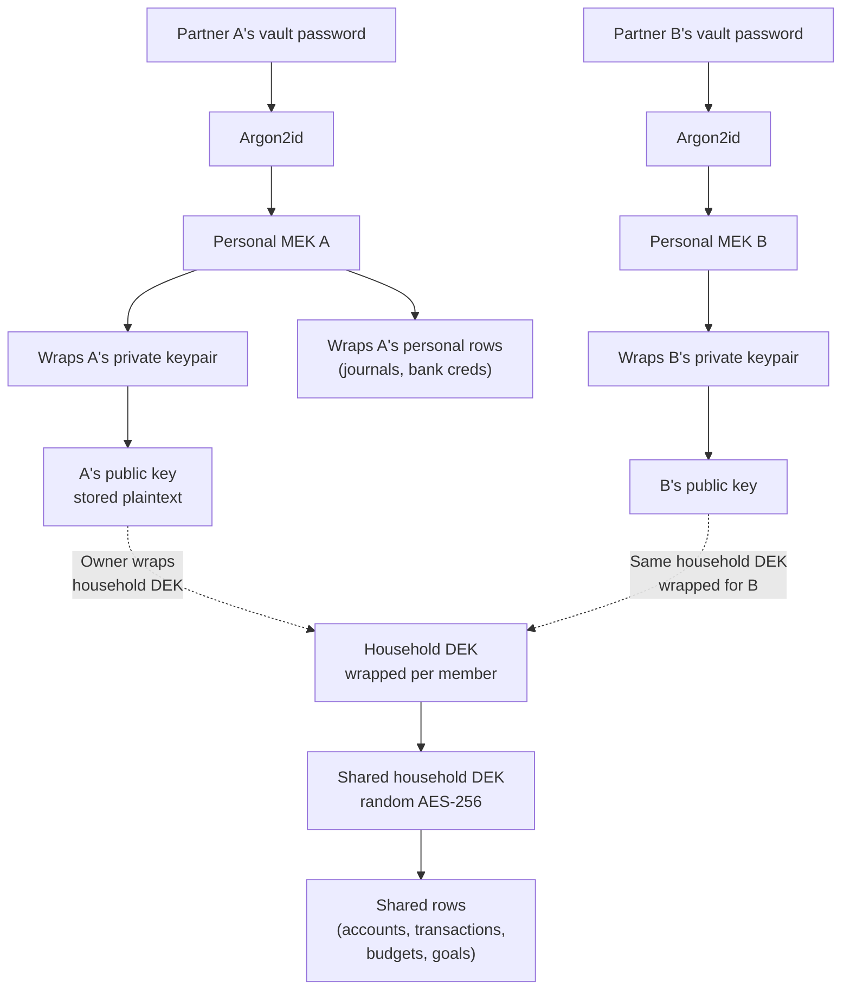

# Phase 4 Design: Household Sharing with Zero-Knowledge Architecture

> **Status:** Implemented (Phases 4.1 through 4.5).
> **Companion:** [Competitive Analysis](https://wiki.orangeway.dev/doc/owm-competitive-analysis-household-sharing-privacy-advisor-e2ee-revocation-s8hsNsaxEp) (maintainer wiki) — research against 10 personal-finance apps.

---

## 0. Executive summary

Phase 4 adds **household sharing** to Orange Way: two adult partners share one encrypted household under one shared data key (DEK), each with their own vault password, each with independently revocable keys. The sharing boundary is opinionated: **accounts, transactions, categories, budgets, goals, rules, and saved reports are shared by default; journals and bank connectors stay personal.**

Three design decisions:

1. **Hybrid post-quantum primitive** (X25519 + ML-KEM-768 KEM, ML-DSA-65 signatures) shared with the OrangeRails cryptographic library.
2. **v1 ships the "normal couple" only.** Ten edge-case scenarios (separation re-key, teen dependents, tax accountant seats, solo→household migration, Shamir recovery) are roadmapped for v1.5, v2, and v3 — not launch blockers.
3. **Transactions become a cryptographic differentiator.** Shared by default, but any partner can re-wrap a single transaction to author-only key — the other partner literally cannot decrypt it, not just "won't see it." Monarch's eye-icon is a UI filter; ours is cryptographic.

Validated against a survey of 10 personal-finance platforms (Monarch, YNAB, Copilot, Lunch Money, Rocket Money, Simplifi, Empower, Actual Budget, Firefly III, Maybe Finance) — see the companion competitive analysis. **No commercial player in this segment ships E2EE / ZKA.** Only Actual Budget does, and only single-user. This is a genuine market gap.

---

## 1. Cryptographic foundation

Hybrid post-quantum: X25519 elliptic-curve KEM combined with ML-KEM-768 (post-quantum) for key encapsulation, ML-DSA-65 for signatures. Implementation lives in `src/lib/pqc.ts` and the household-key helpers under `src/lib/household-*.ts`.

**Household-specific model:** each member holds **two keys** in browser memory after unlock:

1. **Personal MEK** — unwraps their own private vault (journals, bank credentials, recovery)
2. **Household DEK** — decrypts shared rows (accounts, transactions, budgets)

Rows carry a `scope` column: `'personal'` or `'household'`. VaultContext routes encryption/decryption to the right key transparently.



---

## 2. Sharing boundary

Opinionated defaults, partially overridable at the row level. Informed by competitive research.

| Data type                                | Default scope                           | Row-level override?                                      | Rationale                                                                                | Risk if wrong                       |
| ---------------------------------------- | --------------------------------------- | -------------------------------------------------------- | ---------------------------------------------------------------------------------------- | ----------------------------------- |
| **Accounts** (checking, savings, credit) | household                               | Yes — mark personal when opening a new account           | Joint accounts are the default for couples                                               | Medium                              |
| **Transactions**                         | household                               | **Yes — per-row re-wrap to author-only** (cryptographic) | Partners need joint visibility; surprises / gifts must remain hideable cryptographically | Medium                              |
| **Categories / tags**                    | household defaults + per-user overrides | Yes                                                      | Shared taxonomy, but each partner tweaks naming without forcing merge fights             | Low                                 |
| **Budgets**                              | household                               | No                                                       | Budgeting is inherently joint                                                            | Low                                 |
| **Goals**                                | household                               | Yes — personal goals possible                            | Emergency fund joint; retirement may be solo                                             | Low                                 |
| **Recurring rules / automation**         | household defaults + per-user overrides | Yes                                                      | Shared automation, per-user exceptions possible                                          | Low                                 |
| **Journals / notes**                     | **personal**                            | Yes — promote to shared if desired                       | Private reflection must stay with the writer                                             | **High — do NOT default to shared** |
| **Bank connectors / credentials**        | **personal**                            | **No — never shared**                                    | Credentials legally belong to the account holder; sharing breaks bank TOS                | **Critical**                        |
| **Receipt attachments**                  | inherits from transaction               | No — follows parent                                      | Receipts only make sense with context                                                    | Low                                 |
| **Saved reports / dashboards**           | household                               | Yes                                                      | Joint overviews are the norm; personal reports possible                                  | Low                                 |

### Refinements from competitor research

- **Categories and rules are hybrid**, not pure shared. Lunch Money and Copilot both allow per-partner category tweaks; forcing shared-only causes merge fights.
- **Transactions keep per-row re-wrap** as the privacy mechanism. This is the cryptographic differentiator vs Monarch's UI-only eye-icon.
- **Bank connectors leaving with the partner on separation** must be explicit in-product. Monarch surprises users by deleting the leaving partner's accounts.

---

## 3. Schema

```sql
-- Each user's asymmetric public key (X25519 + ML-KEM-768 concatenated, base64)
CREATE TABLE public.user_public_keys (
  user_id        UUID PRIMARY KEY REFERENCES auth.users(id) ON DELETE CASCADE,
  algorithm      TEXT NOT NULL DEFAULT 'x25519-mlkem768-v1',
  public_key_b64 TEXT NOT NULL,
  created_at     TIMESTAMPTZ NOT NULL DEFAULT now()
);

-- Per-household, per-member wrapped DEK
CREATE TABLE public.household_keys (
  id                UUID PRIMARY KEY DEFAULT gen_random_uuid(),
  household_id      UUID NOT NULL REFERENCES public.households(id) ON DELETE CASCADE,
  user_id           UUID NOT NULL REFERENCES auth.users(id) ON DELETE CASCADE,
  enc_household_dek TEXT NOT NULL,                        -- hybrid-KEM wrap to member's public key
  key_version       INTEGER NOT NULL DEFAULT 1,           -- bump on hard re-key
  wrapped_by        UUID REFERENCES auth.users(id),       -- who wrapped it (audit)
  created_at        TIMESTAMPTZ NOT NULL DEFAULT now(),
  revoked_at        TIMESTAMPTZ,
  UNIQUE (household_id, user_id, key_version)
);

-- vault_metadata additions (user's MEK-wrapped private key)
ALTER TABLE public.vault_metadata
  ADD COLUMN IF NOT EXISTS enc_private_key TEXT;

-- Shared tables get a scope column
ALTER TABLE public.transactions    ADD COLUMN scope TEXT NOT NULL DEFAULT 'household' CHECK (scope IN ('personal', 'household', 'author_only'));
ALTER TABLE public.accounts        ADD COLUMN scope TEXT NOT NULL DEFAULT 'household' CHECK (scope IN ('personal', 'household'));
ALTER TABLE public.categories      ADD COLUMN scope TEXT NOT NULL DEFAULT 'household' CHECK (scope IN ('personal', 'household'));
-- ... etc.
```

### `scope = 'author_only'` — the cryptographic privacy differentiator

When a partner re-wraps a single transaction to author-only:

- The row's ciphertext is re-encrypted with a key that exists only in the author's personal keyring
- The household DEK no longer decrypts it
- The other partner sees the row exists (by metadata) but **cannot decrypt the amount, memo, or counterparty** — cryptographic privacy, not a UI filter
- The author can promote it back to `household` later

---

## 4. v1 scope — Normal couple only

**Ships in v1:**

1. **Normal couple** — two adults, one shared household DEK, the 10-row sharing boundary above. Everything works out of the box.
2. **Partner's solo bank account** — personal-scoped connector, summaries only in shared view ("Partner's salary: $X"). Required for realism; most couples have some separate accounts.
3. **Amicable soft-revoke** — delete wrap + member row, no re-encrypt needed. Simple, safe default for partnerships ending on good terms.

**Does NOT ship in v1** (all roadmapped):

- Per-transaction privacy override (v1.5)
- Tax accountant read-only role (v1.5)
- Hard re-key on separation (v2)
- Solo-to-household migration (v2)
- Rules + scope edge cases (v2)
- Multi-household membership (v2)
- Dependent / teen role (v3)
- Shamir 2-of-3 recovery (v3 / paid)

---

## 5. Roadmap

### v1 (shipped)

Normal couple, solo bank accounts, amicable soft-revoke. Phase 4.4 ships the time-boxed Auditor role and customer-support session primitives. Phase 4.5 ships the household-refresh (hard re-key) job framework.

### v1.5

- **Per-transaction privacy override.** Re-wrap to author-only key. Cryptographic differentiator.
- **Tax accountant read-only time-boxed role.** Monarch charges $14.99/mo for this; fast monetization win. Reuses the Auditor primitive shipped in Phase 4.4.

### v2

- **Separation / divorce — hard re-key UX.** No competitor handles this cryptographically. Complex UX (data export, consent, clear about the leaving partner's local cache).
- **Migration from solo vault to household mid-life.** Wizard + per-row opt-in re-encrypt. Needed when users couple up after starting solo.
- **Rules + scope edge cases (documentation).** Low-surface issue; document + test once users report actual confusion.
- **User in multiple households.** Grandparents' + own. Small segment; defer until v1 keypair-per-user model is proven.

### v3 / paid

- **Dependent role (teenager allowance).** Scoped sub-DEK wrapping only their allowance category + personal account. Distinct crypto model; needs its own design pass.
- **Owner-death recovery via Shamir 2-of-3 custody.** Paid tier: legal + ops work (runbook, custodian policy) on top of code. Audited SSS library required.

---

## 6. Stress-test scenarios

All ten must be representable by the v1 + roadmap combination. No custom code per scenario.

1. **Normal couple.** Both adults share everything; no per-row overrides; one household DEK. Works out of the box in v1.
2. **Surprise gift.** Partner A marks a transaction `scope = 'author_only'` before the recurring sync. Partner B can't decrypt. Row-level re-wrap. Ships v1.5.
3. **Separation / divorce.** Hard re-key: new household DEK for remaining Owner, revoke departing partner's access. **Whatever's cached in their browser is theirs offline** — we cannot delete remote devices. Terms must make this clear. v2.
4. **Teenager with allowance.** Dependent role: scoped sub-DEK wrapping only their allowance category + their personal account. Parent controls scope. v3.
5. **Tax accountant, 3 months.** Advisor role: read-only household DEK wrap + `expires_at`. Cannot see Journals. Auto-revoke sweep. v1.5.
6. **Owner dies (recovery).** Shamir 2-of-3: one share with the founder + one with a nominated relative + one with the Owner. v3 / paid.
7. **Partner's solo bank account.** Connector stays personal; transactions inherit `personal` scope by default; partner can surface summaries only. v1.
8. **Solo to household mid-life.** Migration wizard: generate household DEK; re-encrypt existing 'personal' rows the user opts to share; leave the rest personal. v2.
9. **User in two households** (grandparents + own). One keypair per user; two wrap rows. VaultContext tracks `activeHouseholdId`. v2.
10. **Rule + mixed scope.** Rule says "categorize all Starbucks as Dining". Partner B marks one transaction personal → rule cannot read the personal row unless scoped household. Document the edge case. v2.

---

## 7. Invite / revoke flows

1. **Roles are flat:** Owner, Partner, Dependent (v3), Advisor (v1.5). No capability matrix needed — the sharing boundary is the permission model.
2. **Bitwarden pattern applies:** Owner must be online to complete the wrap when inviting Partner. Accepted for v1.

The full invite flow (email-based, with public-key wrapping completed asynchronously when the recipient publishes their keypair) is implemented in Phase 4.3 — see migration `20260427000000_orangeway_phase4_3_invites.sql` and `src/lib/household-invite-wrap.ts`.

---

## 8. Monetization levers

From competitive research — all validated in the segment:

| Lever                                     | Segment precedent                        | Orange Way angle                                        |
| ----------------------------------------- | ---------------------------------------- | ------------------------------------------------------- |
| **Tax accountant seat ($14.99/mo)**       | Monarch charges exactly this per client  | Uses the Auditor primitive shipped in Phase 4.4         |
| **Shamir custody / Owner-death recovery** | None in segment — differentiator         | Paid tier (requires legal + ops runbook, not just code) |
| **Dependent / teen sub-vault**            | YNAB gestures at this; none ship it      | Family-plan upsell                                      |
| **Per-transaction cryptographic privacy** | None in segment                          | Possible "Private Vault" tier OR free differentiator    |
| **Household beyond N members**            | YNAB Together: 6 included; Monarch: flat | Extended family plan                                    |

Primary early revenue likely comes from **tax accountant seats** (fast, validated pricing, obvious value). Shamir custody is slower to build but durable competitive moat.

---

## 9. Market gap: why ZKA matters here

The research confirms what we hoped:

- **Every commercial competitor** (Monarch, YNAB, Copilot, Lunch Money, Rocket, Simplifi, Empower) is server-readable. AES-256 at rest + TLS in transit, but the server can decrypt.
- **Actual Budget** is the only E2EE player and is single-user only; no multi-user revocation, no sharing.
- **No competitor handles separation / divorce cryptographically.** Monarch deletes accounts; Rocket resets the leaving user's app; Actual just leaves them with a full offline copy.

Orange Way with household ZKA + cryptographic revocation is a clean market gap. The feature set competitors take for granted — per-row privacy, advisor seats, household sharing — becomes _cryptographic_ in our implementation. That's the differentiator we should lead with on the website.

---

## 10. Decisions locked

**Rule for future agents:** do not change anything in this section without explicit user approval. These decisions drive implementation. If a decision seems wrong, raise it — don't silently refactor around it.

### Sharing boundary

**Locked.** The 10-row sharing boundary in §2 is the v1 default. Categories and rules are hybrid (household defaults + per-user overrides). Transactions are shared-by-default with per-row cryptographic override — the Monarch-vs-us differentiator.

### Invite wrap: who can complete it?

**Locked.** Any household member with the `household.invite` capability. In v1 that's the Owner (Partner has full data access but no invite rights by default — v1 has only two adults). Capability-based so when additional roles ship in v2/v3, `household.invite` can be granted explicitly.

**Marketing copy angle:** _"We don't hold your keys. That's why your Owner has to unlock to invite a partner. Even we can't do it."_ Sovereignty is the pitch.

### Recovery custody (paid tier)

**Locked.** Shamir 2-of-3 custody shipped as a **paid SKU at v3**:

- Customer holds 2 shares (their own + nominated relative / partner / lawyer)
- The founder holds 1 share
- Recovery requires any 2

**v1 does NOT ship custody.** v1 requires mandatory recovery-code verification at vault setup (user types it back to confirm they wrote it down) — catches ~95% of lost-password scenarios.

### Password change does NOT re-encrypt household DEK

**Locked.** Password change re-wraps only the user's hybrid private key with the new MEK. **Household DEK is untouched.** No full-data re-encrypt, no partner re-wrap needed.

**Not a ZKA-destroyer.** Industry standard (Bitwarden, Proton, 1Password). **Implementation guardrail:** use atomic UPDATE on `user_vault_keys` — never DELETE+INSERT. Unit test: exactly one row per user.

### Master keypair architecture

**Locked for v1.** One hybrid keypair per user globally. Household scale (2 adults + maybe 2 dependents at v3) doesn't hit the blast-radius concern that drives enterprise tiers.

**v2 roadmap:** hardware-backed keys (WebAuthn / passkey) are valuable for any customer and will be added as a follow-on.

### Dependent / teen role

**Locked as v3 feature.** Distinct crypto model (scoped sub-DEK). Requires its own design pass. v1 ships two adults only.

---

## 11. Security properties

| Property                                  | How                                                             |
| ----------------------------------------- | --------------------------------------------------------------- |
| Server never reads books                  | Household DEK only in browser; server stores wraps + ciphertext |
| Each partner has their own vault password | Personal MEK unwraps only their own private key                 |
| Invite without sharing password           | Hybrid-KEM wrap of household DEK to invitee's public key        |
| Per-row cryptographic privacy             | `scope = 'author_only'` re-encrypts with author-only key        |
| Revoke                                    | Soft = remove wrap; hard = new DEK + re-encrypt                 |
| Post-quantum safe                         | X25519 + ML-KEM-768 hybrid                                      |
| Owner recovery (paid)                     | Shamir 2-of-3 split — no single party can recover               |

---

## 12. References

- **Competitive analysis**: [maintainer wiki](https://wiki.orangeway.dev/doc/owm-competitive-analysis-household-sharing-privacy-advisor-e2ee-revocation-s8hsNsaxEp) — 10 platforms, patterns, market gaps, cited URLs.
- **Post-quantum design reference**: maintainer notes.
- **@noble/post-quantum** (ML-KEM-768, ML-DSA-65), **@noble/curves** (X25519), **@noble/hashes** (HKDF-SHA-256).
